## 一、欢迎来到 Docker 世界

### 1. Docker 与虚拟化

在没有 Docker 的时代，我们会使用硬件虚拟化（虚拟机）以提供隔离。这里，虚拟机通过在操作系统上建立了一个中间虚拟软件层 Hypervisor ，并利用物理机器的资源虚拟出多个虚拟硬件环境来共享宿主机的资源，其中的应用运行在虚拟机内核上。但是，虚拟机对硬件的利用率存在瓶颈，因为虚拟机很难根据当前业务量动态调整其占用的硬件资源，因此容器化技术得以流行。其中，Docker 是一个开源的应用容器引擎，让开发者可以打包他们的应用以及依赖包到一个可移植的容器中，然后发布到任何流行的 Linux 机器上。
[](https://p1-jj.byteimg.com/tos-cn-i-t2oaga2asx/gold-user-assets/2019/4/9/16a02cdab48514e3~tplv-t2oaga2asx-jj-mark:3024:0:0:0:q75.awebp)
Docker 容器不使用硬件虚拟化，它的守护进程是宿主机上的一个进程，换句话说，应用直接运行在宿主机内核上。因为容器中运行的程序和计算机的操作系统之间没有额外的中间层，没有资源被冗余软件的运行或虚拟硬件的模拟而浪费掉。

Docker 的优势不仅如此，我们来比较一番。

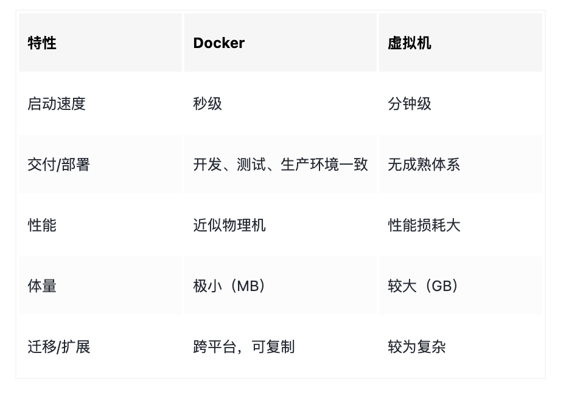

### 2. 镜像、容器和仓库

Docker 由镜像(Image)、容器(Container)、仓库(Repository) 三部分组成。

Docker 的镜像可以简单的类比为电脑装系统用的系统盘，包括操作系统，以及必要的软件。例如，一个镜像可以包含一个完整的 centos 操作系统环境，并安装了 Nginx 和 Tomcat 服务器。注意的是，镜像是只读的。这一点也很好理解，就像我们刻录的系统盘其实也是可读的。我们可以使用 `docker images` 来查看本地镜像列表。

Docker 的容器可以简单理解为提供了系统硬件环境，它是真正跑项目程序、消耗机器资源、提供服务的东西。例如，我们可以暂时把容器看作一个 Linux 的电脑，它可以直接运行。那么，容器是基于镜像启动的，并且每个容器都是相互隔离的。注意的是，容器在启动的时候基于镜像创建一层可写层作为最上层。我们可以使用 `docker ps -a` 查看本地运行过的容器。

Docker 的仓库用于存放镜像。这一点，和 Git 非常类似。我们可以从中心仓库下载镜像，也可以从自建仓库下载。同时，我们可以把制作好的镜像 commit 到本地，然后 push 到远程仓库。仓库分为公开仓库和私有仓库，最大的公开仓库是官方仓库 Dock Hub，国内的公开仓库也有很多选择，例如阿里云等。

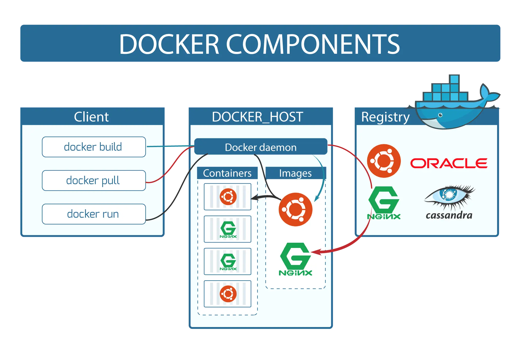

### 3. Docker 促使开发流程变更

笔者认为，Docker 对开发流程的影响在于使环境标准化。例如，原来我们存在三个环境：开发（日常）环境、测试环境、生产环境。这里，我们对于每个环境都需要部署相同的软件、脚本和运行程序，如图所示。事实上，对于启动脚本内容都是一致的，但是没有统一维护，经常会出问题。此外，对于运行程序而言，如果所依赖的底层运行环境不一致，也会造成困扰和异常。


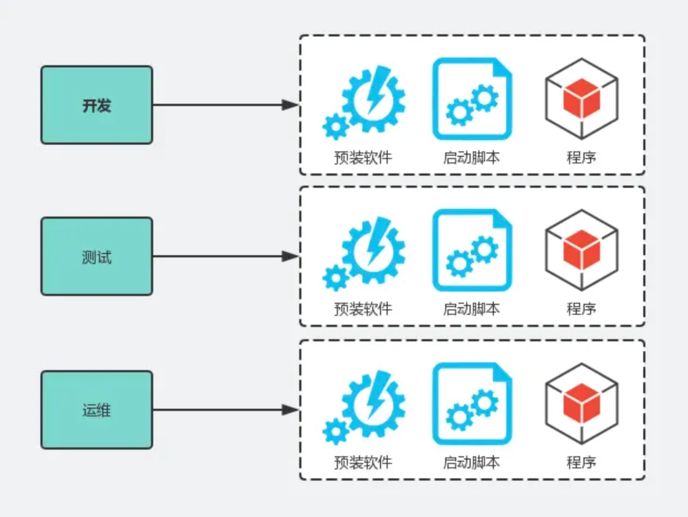

现在，我们通过引入 Docker 之后，我们只需要维护一个 Docker 镜像。换句话说，多套环境，一个镜像，实现系统级别的一次构建到处运行。此时，我们把运行脚本标准化了，把底层软件镜像化了，然后对于相同的将要部署的程序实行标准化部署。因此，Docker 为我们提供了一个标准化的运维模式，并固化运维步骤和流程。

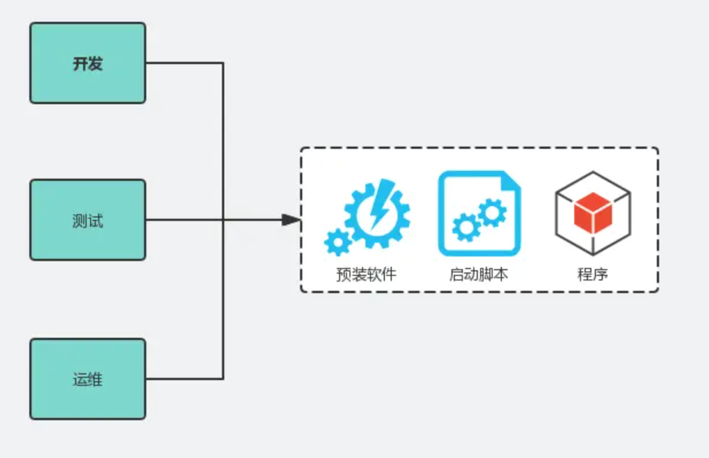

通过这个流程的改进，我们更容易实现 DevOps 的目标，因为我们的镜像生成后可以跑在任何系统，并快速部署。此外，使用 Docker 的很大动力是基于 Docker 实现弹性调度，以更充分地利用机器资源，节省成本。


## 二、从搭建 Web 服务器开始说起

现在，我们需要安装以下步骤安装 Docker。

- 注册帐号：在 [ 注册账号](hub.docker.com/)。
- 下载安装

> [官方下载地址](https://www.docker.com/products/docker-desktop/)

- 安装指南 这里，双击刚刚下载的 Doker.dmg 安装包进行安装。

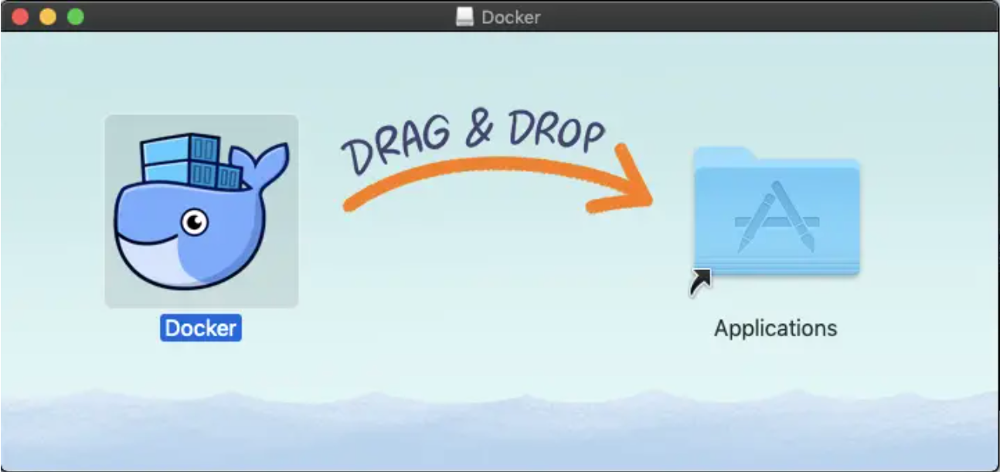

安装完成后启动， Mac 顶部导航栏出现了一个图标，通过菜单可以进行 docker 配置和退出等操作。

> [官方指南](https://docs.docker.com/engine/install/)

- 设置加速服务

市面上有很多加速服务的提供商，如：DaoCloud，阿里云等。这里，笔者使用的是阿里云。（注意的是，笔者操作系统是 Mac，其他操作系列参见阿里云操作文档）

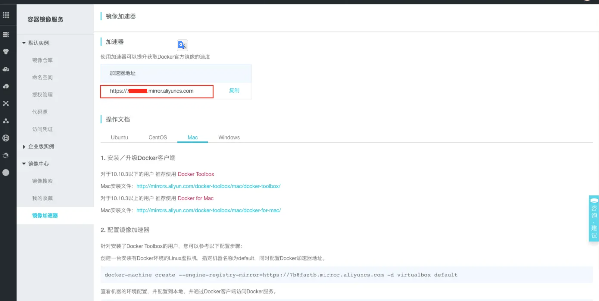

右键点击桌面顶栏的 docker 图标，选择 Preferences ，在 Daemon 标签（Docker 17.03 之前版本为 Advanced 标签）下的 Registry mirrors 列表中将
`https://xxx.mirror.aliyuncs.com` 加到"registry-mirrors"的数组里，点击 Apply & Restart 按钮，等待 Docker 重启并应用配置的镜像加速器。

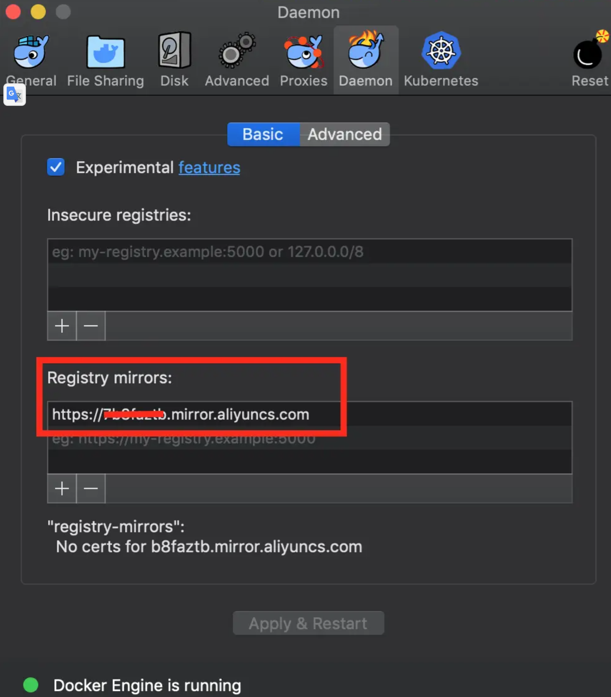

- 查看版本

至此，我们已经安装完成了。这里，我们来查看版本。

```
docker version
```

查看结果，如下所示。

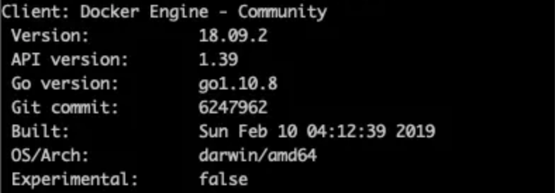

### 2. 实干派，从搭建 Web 服务器开始

我们作为实干派，那么先来搭建一个 Web 服务器吧。然后，笔者带你慢慢理解这个过程中，做了什么事情。首先，我们需要拉取 centos 镜像。

```
docker run -p 80 --name web -i -t centos /bin/bash
```

紧接着，我们安装 nginx 服务器，执行以下命令：

```
rpm -ivh http://nginx.org/packages/centos/7/noarch/RPMS/nginx-release-centos-7-0.el7.ngx.noarch.rpm
```

安装完 Nginx 源后，就可以正式安装 Nginx 了。

```
yum install -y nginx
```

至此，我们再输入 `whereis nginx` 命令就可以看到安装的路径了。最后，我们还需要将 Nginx 跑起来。

```
nginx
```

现在，我们执行 `ctrl + P +  Q` 切换到后台。然后，通过 `docker ps -a` 来查看随机分配的端口。这里，笔者分配的端口是 `32769` ，那么通过浏览器访问 `http://127.0.0.1:32769` 即可。

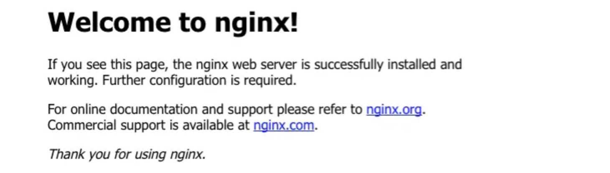

### 3. 复盘理解全过程

现在，我们来理解下这个流程。首先，我们输入 `docker run -p 80 --name web -i -t centos /bin/bash` 命令会运行交互式容器，其中 `-i` 选项告诉 Docker 容器保持标准输入流对容器开放，即使容器没有终端连接，另一个 `-t` 选项告诉 Docker 为容器分配一个虚拟终端，以便于我们接下来安装 Nginx 服务器。（笔者备注：Docker 还支持输入 `-d` 选项告诉 Docker 在后台运行容器的守护进程）

Docker 会为我们创建的每一个容器自动生成一个随机的名称。事实上，这种方式虽然便捷，但是可读性很差，并且对我们后期维护的理解成本会比较大。因此，我们通过 `--name web` 选项告诉 Docker 创建一个名称是 `web` 的容器。此外，我们通过 `-p 80` 告诉 Docker 开放 80 端口，那么， Nginx 才可以对外通过访问和服务。但是，我们的宿主机器会自动做端口映射，比如上面分配的端口是 `32769` ，注意的是，如果关闭或者重启，这个端口就变了，那么怎么解决固定端口的问题，笔者会在后面详细剖析和带你实战。

这里，还有一个非常重要的知识点 `docker run` 。Docker 通过 run 命令来启动一个新容器。Docker 首先在本机中寻找该镜像，如果没有安装，Docker 在 Docker Hub 上查找该镜像并下载安装到本机，最后 Docker 创建一个新的容器并启动该程序。

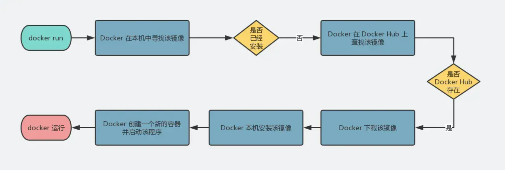

但是，当第二次执行 `docker run` 时，因为 Docker 在本机中已经安装该镜像，所以 Docker 会直接创建一个新的容器并启动该程序。

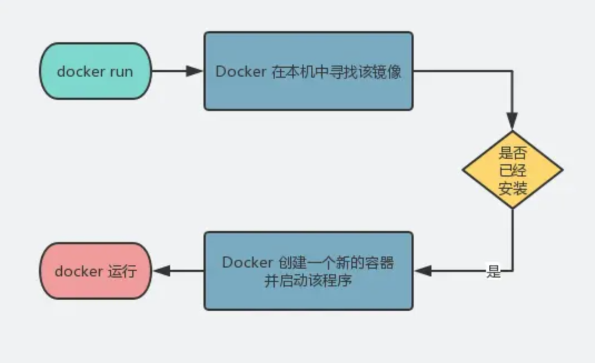

注意的是，`docker run` 每次使用都会创建一个新的容器，因此，我们以后再次启动这个容器时，只需要使用命令 `docker start` 即可。这里， `docker start` 的作用在用重新启动已存在的镜像，而`docker run` 包含将镜像放入容器中 `docker create` ，然后将容器启动 `docker start` ，如图所示。


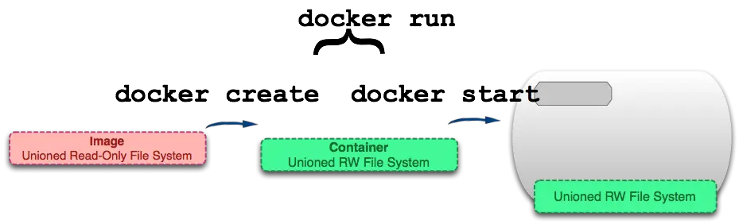

现在，我们可以在上面的案例的基础上，通过 `exit` 命令关闭 Docker 容器。当然，如果我们运行的是后台的守护进程，我们也可以通过 `docker stop web` 来停止。注意的是，`docker stop` 和 `docker kill` 略有不同，`docker stop` 发送 SIGTERM 信号，而 `docker kill` 发送SIGKILL 信号。然后，我们使用 `docker start` 重启它。

```
docker start web
```

Docker 容器重启后会沿用 `docker run` 命令指定的参数来运行，但是，此时它还是后台运行的。我们必须通过 `docker attach` 命令切换到运行交互式容器。

```
docker attach web
```

### 4. 不止如此，还有更多命令

Docker 提供了非常丰富的命令。所谓一图胜千言，我们可以从下面的图片了解到很多信息和它们之前的用途。

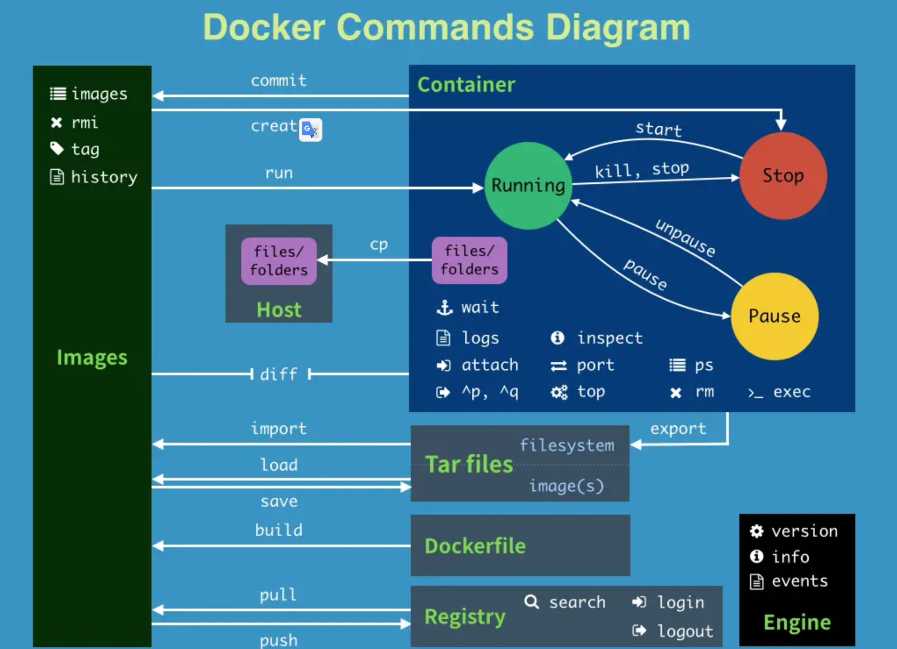

如果希望获取更多信息，可以阅读官方使用文档。

> [官方阅读链接](https://docs.docker.com/reference/cli/docker/)

### 5. 进阶：仓库与软件安装的简化

Docker 的仓库用于存放镜像。我们可以从中心仓库下载镜像，也可以从自建仓库下载。同时，我们可以把制作好的镜像从本地推送到远程仓库。

首先，笔者先引入一个知识点：Docker 的镜像就是它的文件系统，一个镜像可以放在另外一个镜像的上层，那么位于下层的就是它的父镜像。所以，Docker 会存在很多镜像层，每个镜像层都是只读的，并且不会改变。当我们创建一个新的容器时，Docker 会构建出一个镜像栈，并在栈的最顶层添加一个读写层，如图所示。

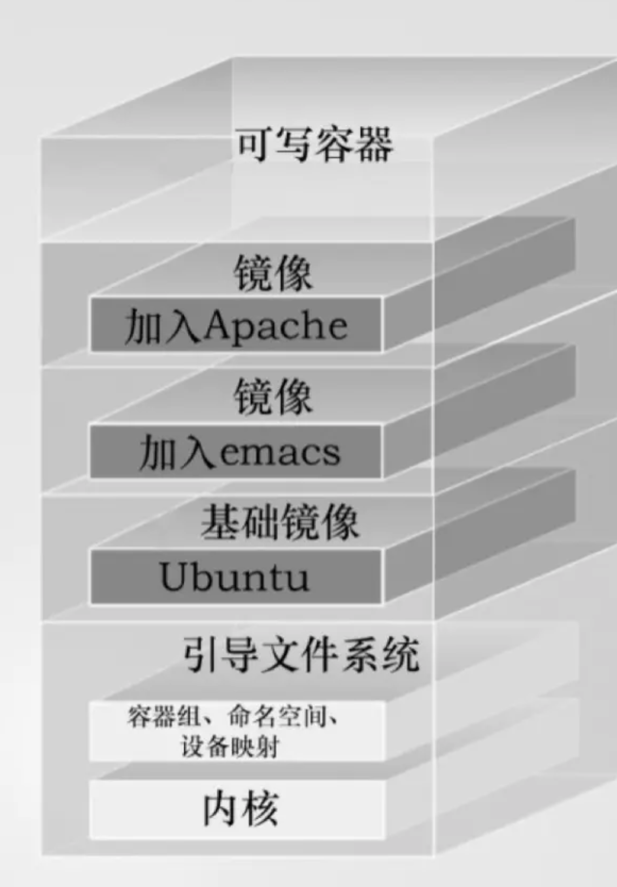

现在，我们可以通过 `docker images` 命令查看本地的镜像。

```
docker images
```

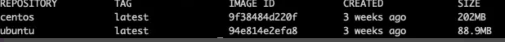

这里，对几个名词解释一下含义。

- REPOSITORY：仓库名称。
- TAG： 镜像标签，其中 lastest 表示最新版本。注意的是，一个镜像可以有多个标签，那么我们就可以通过标签来管理有用的版本和功能标签。
- IMAGE ID ：镜像唯一ID。
- CREATED ：创建时间。
- SIZE ：镜像大小。

那么，如果第一次我们通过 `docker pull centos:latest` 拉取镜像，那么当我们执行 `docker run -p 80 --name web -i -t centos /bin/bash` 时，它就不会再去远程获取了，因为本机中已经安装该镜像，所以 Docker 会直接创建一个新的容器并启动该程序。

事实上，官方已经提供了安装好 Nginx 的镜像，我们可以直接使用。现在，我们通过拉取镜像的方式重新构建一个 Web 服务器。首先，我们通过 `docker search` 来查找镜像。我们获取到 Nginx 的镜像清单。

```
docker search nginx
```

补充一下，我们也可以通过访问 Docker Hub ([hub.docker.com/](https://link.juejin.cn/?target=https%3A%2F%2Fhub.docker.com%2F))搜索仓库，那么 star 数越多，说明它越靠谱，可以放心使用。

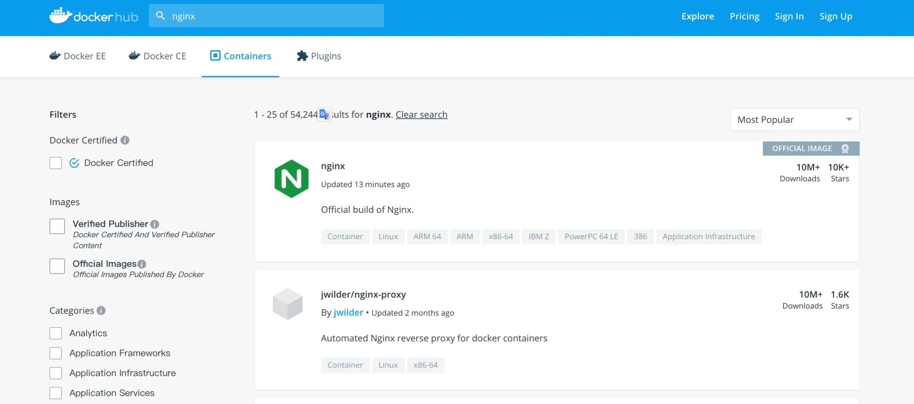

现在，我们通过 `docker pull nginx` 拉取最新的 Nginx 的镜像。当然，我们也可以通过 `docker pull nginx:latest` 来操作。

```
docker pull nginx
```

然后，我们创建并运行一个容器。与前面不同的是，我们通过 `-d` 选项告诉 Docker 在后台运行容器的守护进程。并且，通过 `8080:80` 告诉 Docker 8080 端口是对外开放的端口，80 端口对外开放的端口映射到容器里的端口号。

```
docker run -p 8080:80 -d --name nginx nginx
```

我们再通过 `docker ps -a` 来查看，发现容器已经后台运行了，并且后台执行了 nginx 命令，并对外开放 8080 端口。

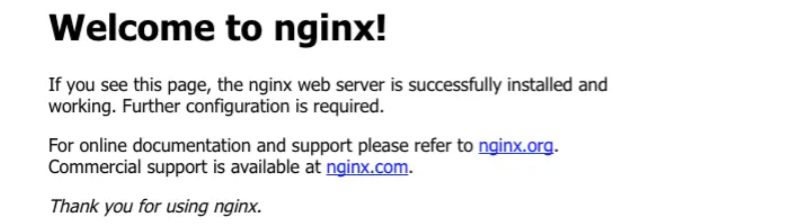

### 6. 其他选择，使用替代注册服务器

Docker Hub 不是软件的唯一来源，我们也可以切换到国内的其他替代注册服务器，例如阿里云。我们可以登录 [cr.console.aliyun.com](https://account.aliyun.com/login/login.htm?oauth_callback=https%3A%2F%2Fcr.console.aliyun.com%2F&lang=zh) 搜索，并拉取公开的镜像。

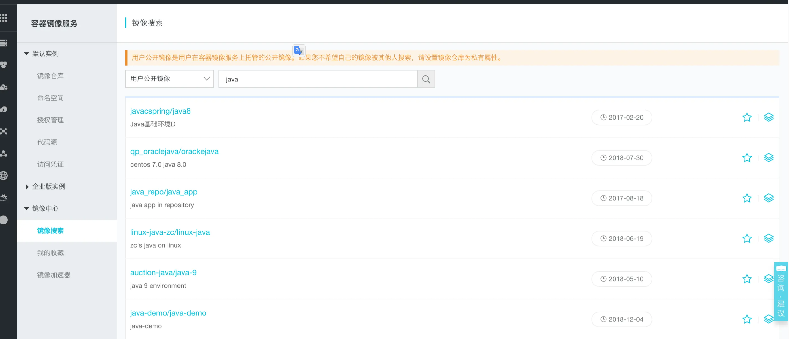

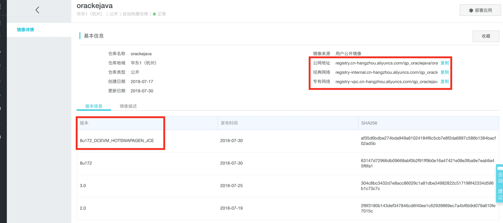

现在，我们输入 `docker pull` 命令进行拉取。

```
docker pull registry.cn-hangzhou.aliyuncs.com/qp_oraclejava/orackejava:8u172_DCEVM_HOTSWAPAGEN_JCE
```

这里，笔者继续补充一个知识点：注册服务器的地址。事实上，注册服务器的地址是有一套规范的。完整格式是：[仓库主机/][用户名/]容器短名[:标签]。这里，仓库主机是 registry.cn-hangzhou.aliyuncs.com，用户名是 qp_oraclejava，容器短名是 orackejava，标签名是 8u172_DCEVM_HOTSWAPAGEN_JCE。事实上，我们上面通过 `docker pull centos:latest` 拉取镜像，相当于 `docker pull registry.hub.docker.com/centos:latest` 。


## 三、构建我的镜像

通过上面的学习，笔者相信你已经对 Docker 使用有了一个大致的了解，就好比我们通过 VMware 安装了一个系统，并让它跑了起来，那么我们就可以在这个 Linux 系统（CentOS 或者 Ubuntu ） 上面工作我们想要的任何事情。事实上，我们还会经常把我们安装好的 VMware 系统进行快照备份并实现克隆来满足我们下次快速的复制。这里，Docker 也可以构建定制内容的 Docker 镜像，例如上面我们使用官方提供的安装好 Nginx 的 Docker 镜像。注意的是，我们通过基于已有的基础镜像，在上面添加镜像层的方式构建新镜像而已。

总结一下，Docker 提供自定义镜像的能力，它可以让我们保存对基础镜像的修改，并再次使用。那么，我们就可以把操作系统、运行环境、脚本和程序打包在一起，并在宿主机上对外提供服务。

Docker 构建镜像有两种方式，一种方式是使用 `docker commit` 命令，另外一种方式使用 `docker build` 命令和 `Dockerfile` 文件。其中，不推荐使用 `docker commit` 命令进行构建，因为它没有使得整个流程标准化，因此，在企业的中更加推荐使用 `docker build` 命令和 `Dockerfile` 文件来构建我们的镜像。我们使用`Dockerfile` 文件可以让构建镜像更具备可重复性，同时保证启动脚本和运行程序的标准化。

### 1. 构建第一个 Dockerfile 文件

现在，我们继续实战。这里，我们把一开始搭建的 Web 服务器构建一个镜像。首先，我们需要创建一个空的 Dokcerfile 文件。

```
mkdir dockerfile_test
cd dockerfile_test/
touch Dockerfile
nano Dockerfile
```

紧接着，我们需要编写一个 Dockerfile 文件，代码清单如下

```
docker build -t="lianggzone/nginx_demo:v1" .
```

现在， 我们来通过 `docker images` 看下我们的新镜像吧。

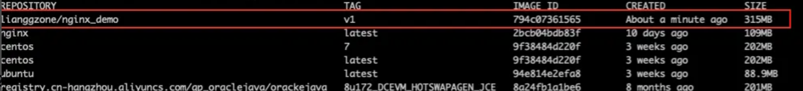

### 2. 理解 Dockerfile 全过程

哇，我们通过编写一个 Dockerfile 文件顺利构建了一个新的镜像。这个过程简单得让人无法相信。现在，让我们来理解一下这个全过程吧。首先， `FROM centos:7` 是 Dockerfile 必须要的第一步，它会从一个已经存在的镜像运行一个容器，换句话说，Docker 需要依赖于一个基础镜像进行构建。这里，我们指定 centos 作为基础镜像，它的版本是 7 (CentOS 7)。然后，我们通过 `MAINTAINER Zcoldlike "zcoldlike@163.com"` 指定该镜像的作者是 Zcoldlike，邮箱是 xxx。这有助于告诉使用者它的作者和联系方式。接着，我们执行两个 RUN 指令进行 Nginx 的下载安装，最后通过 `EXPOSE 80` 暴露 Dokcer 容器的 80 端口。注意的是，Docker 的执行顺序是从上而下执行的，所以我们要明确整个流程的执行顺序。除此之外，Docker 在执行每个指令之后都会创建一个新的镜像层并且进行提交。

我们使用 `docker build` 命令进行构建，指定 `- t` 告诉 Docker 镜像的名称和版本。注意的是，如果没有指定任何标签，Docker 将会自动为镜像设置一个 lastest 标签。还有一点，我们最后还有一个 `.` 是为了让 Docker 到当前本地目录去寻找 Dockerfile 文件。注意的是，Docker 会在每一步构建都会将结果提交为镜像，然后将之前的镜像层看作缓存，因此我们重新构建类似的镜像层时会直接复用之前的镜像。如果我们需要跳过，可以使用 `--no-cache` 选项告诉 Docker 不进行缓存。

### 3. Dockerfile 指令详解

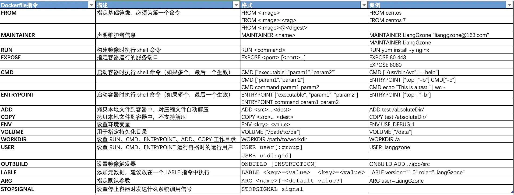


#### 指令辨别一：RUN、CMD、ENTRYPOINT

`RUN` 、 `CMD` 、 `ENTRYPOINT` 三个指令的用途非常相识，不同在于，`RUN` 指令是在容器被构建时运行的命令，而`CMD` 、 `ENTRYPOINT` 是启动容器时执行 shell 命令，而 `RUN` 会被 `docker run` 命令覆盖，但是 `ENTRYPOINT` 不会被覆盖。事实上，`docker run` 命令指定的任何参数都会被当作参数再次传递给 `ENTRYPOINT` 指令。`CMD` 、 `ENTRYPOINT` 两个指令之间也可以一起使用。例如，我们 可以使用 `ENTRYPOINT` 的 exec 形式设置固定的默认命令和参数，然后使用任一形式的 `CMD` 来设置可能更改的其他默认值。

```
FROM ubuntu
ENTRYPOINT ["top", "-b"]
CMD ["-c"]
```

#### 指令辨别二：ADD、COPY

`ADD` 、 `COPY` 指令用法一样，唯一不同的是 `ADD` 支持将归档文件（tar, gzip, bzip2, etc）做提取和解压操作。注意的是，`COPY` 指令需要复制的目录一定要放在 Dockerfile 文件的同级目录下。

### 4. 将镜像推送到远程仓库

#### 远程仓库：Docker Hub

镜像构建完毕之后，我们可以将它上传到 Docker Hub 上面。首先，我们需要通过 `docker login` 保证我们已经登录了。紧接着，我们使用 `docker push` 命令进行推送。

```
docker push lianggzone/nginx_demo:v1
```

#### 远程仓库：阿里云

同时，我们也可以使用国内的仓库，比如阿里云。首先，在终端中输入访问凭证，登录 Registry 实例。如果你不知道是哪个，可以访问 [cr.console.aliyun.com/cn-hangzhou…](https://account.aliyun.com/login/login.htm?oauth_callback=https%3A%2F%2Fcr.console.aliyun.com%2Fcn-hangzhou%2Finstances%2Fcredentials&lang=zh)。

```
复制代码docker login --username=帐号 registry.cn-hangzhou.aliyuncs.com
```

现在，将镜像推送到阿里云镜像仓库。其中， `docker tag [IMAGE_ID] registry.cn-hangzhou.aliyuncs.com/[命名空间]/[镜像名称]:[版本]` 和 `docker push registry.cn-hangzhou.aliyuncs.com/[命名空间]/[镜像名称]:[版本]` 命令的使用如下所示。

```
复制代码docker tag 794c07361565 registry.cn-hangzhou.aliyuncs.com/lianggzone/nginx_demo:v1
docker push registry.cn-hangzhou.aliyuncs.com/lianggzone/nginx_demo:v1
```

最后，上传完成后访问，如图所示。

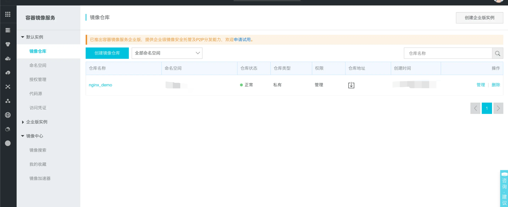


## 附：参考资料


- 《Docker实战》
- 《第一本Docker书》
- [Docker 命令参考文档](https://docs.docker.com/engine/reference/commandline/cli/?spm=5176.8351553.0.0.6eb21991rT7ejF)
- [Dockerfile 镜像构建参考文档](https://docs.docker.com/reference/dockerfile/)

